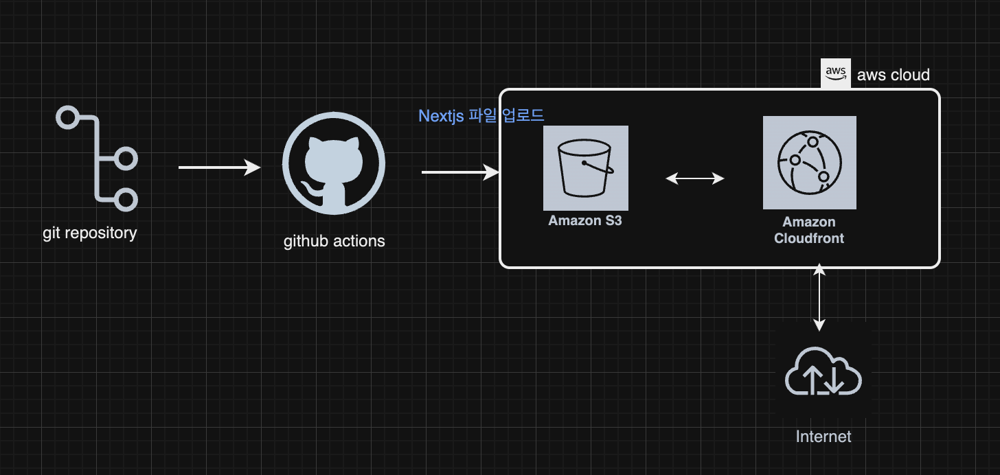

## 프론트엔드 배포 라인

## 다이어그램 

## GitHub Actions에 워크플로우

#### 1. 저장소 체크아웃 
- main branch에 푸쉬하면 GitHub Actions가 Git 저장소의 코드를 가져온다

#### 2. 프로젝트 의존성 설치
- 프로젝트에 필요한 라이브러리 및 패키지를 설치.
- `npm ci`` 명령어를 사용하여 package-lock.json에 정의된 버전에 따라 패키지를 설치한다.

#### 3. 프로젝트 빌드
- Next.js 프로젝트를 빌드하여 배포 가능한 정적 파일과 아웃풋을 생성한다.

#### 4. AWS 자격증명 구성
- GitHub Secrets에서 제공된 키를 활용하여 S3 및 CloudFront와의 통신을 인증한다. 
- AWS_ACCESS_KEY_ID: IAM 계정 생성시 발급받은 액세스 키
- AWS_SECRET_ACCESS_KEY: IAM 계정 생성시 발급받은 비밀 액세스 키
- AWS_REGION: S3를 세팅한 리전(지역)의 코드
- S3_BUCKET_NAME: 빌드 산출물을 업로드할 S3 버킷 이름
- CLOUDFRONT_DISTRIBUTION_ID: S3와 연결된 CloudFront 배포 ID

#### 5. S3 버킷 동기화 
- 빌드된 파일을 S3 버킷과 동기화 `aws s3 sync out/ s3://${{ secrets.S3_BUCKET_NAME }} --delete` 명령어로 파일 업로드 및 불필요한 파일은 삭제한다.

#### 6. CloutFront 캐시 무효화
- S3 버킷의 업데이트된 파일이 즉시 반영되도록 CloudFront 캐시를 무효화한다.
- `/* ` 경로를 무효화해 사용자에게 최신 콘텐츠가 제공된다.

## 주요 링크

#### S3 버킷 웹사이트 
- [S3 Bucket 링크](http://hanghae-eslim.s3-website-us-east-1.amazonaws.com/)

#### CloudFront 배포 도메인 
- [CloudFront 배포 링크](https://djnv99oezjwax.cloudfront.net/)

## 주요 개념

#### GitHub Actions과 CI/CD 도구
- GitHub Actions는 GitHub 저장소 내에서 CI/CD 워크플로우를 자동화하는 도구이다.
- 다양한 작업 단계를 정의하여 코드 빌드, 테스트, 배포 프로세스를 효율화할 수 있다.

#### S3와 스토리지
- **Amazon S3(Simple Storage Service)**는 객체 스토리지 서비스로, 정적 웹사이트와 애플리케이션 파일을 저장 및 제공하는 데 사용된다.
- S3는 고가용성과 확장성을 제공하며, 정적 파일 배포에 적합하다.

#### CloudFront와 CDN
- Amazon CloudFront는 AWS의 콘텐츠 전송 네트워크(CDN)로, 전 세계의 엣지 서버를 통해 콘텐츠를 빠르고 안전하게 배포한다.
- S3와 결합하여 정적 파일의 로드 타임을 줄이고 사용자 경험을 개선한다.

#### 캐시 무효화(Cache Invalidation)
- CDN은 콘텐츠를 캐싱해 빠르게 제공하지만, 업데이트된 콘텐츠는 무효화하지 않으면 반영되지 않는다.
- 캐시 무효화는 CloudFront 배포에서 특정 파일 또는 전체 파일을 강제로 새로 고침하여 최신 버전이 제공되도록 한다.

#### Repository secret과 환경변수
- GitHub Secrets는 보안 정보(AWS 키, S3 버킷 이름 등)를 저장하고 워크플로우에서 사용하는 기능이다.
- 환경변수로 지정된 Secret 값은 보안이 유지된 상태로 액션 내에서 참조된다. `(${{ secrets.KEY_NAME }})`
