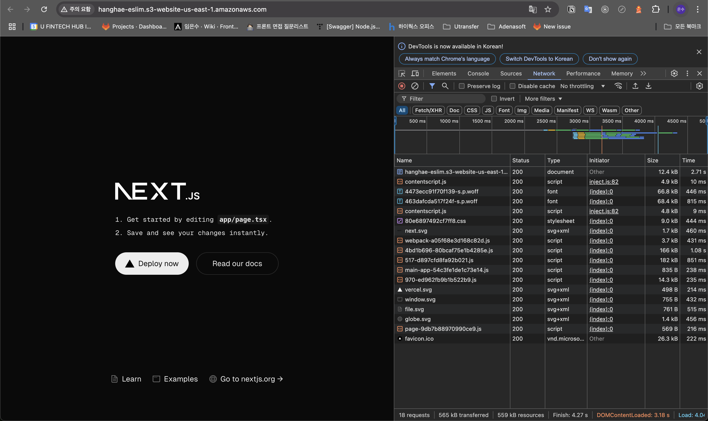
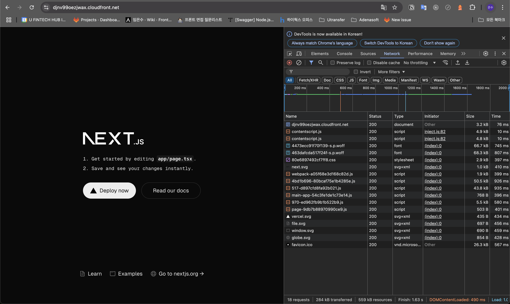
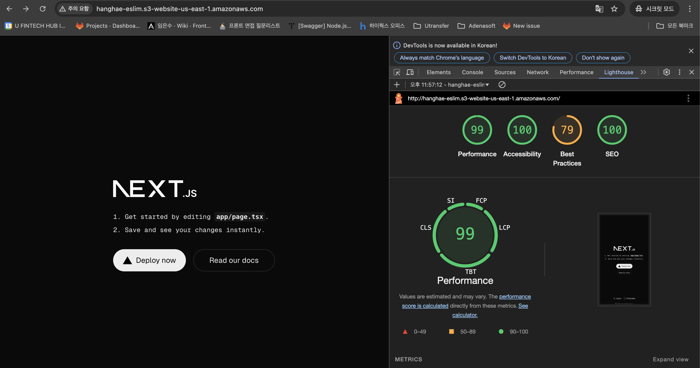
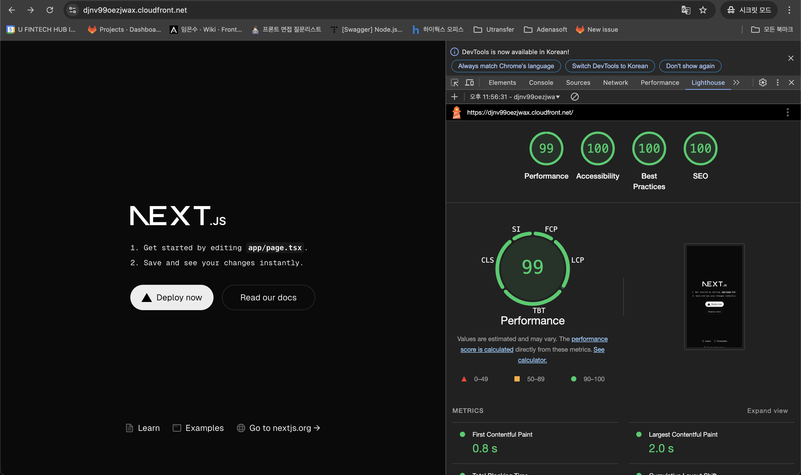

## 프론트엔드 배포 라인

## 다이어그램 

## GitHub Actions에 워크플로우

#### 1. 저장소 체크아웃 
- main branch에 푸쉬하면 GitHub Actions가 Git 저장소의 코드를 가져온다

#### 2. 프로젝트 의존성 설치
- 프로젝트에 필요한 라이브러리 및 패키지를 설치.
- `npm ci`` 명령어를 사용하여 package-lock.json에 정의된 버전에 따라 패키지를 설치한다.

#### 3. 프로젝트 빌드
- Next.js 프로젝트를 빌드하여 배포 가능한 정적 파일과 아웃풋을 생성한다.

#### 4. AWS 자격증명 구성
- GitHub Secrets에서 제공된 키를 활용하여 S3 및 CloudFront와의 통신을 인증한다. 
- AWS_ACCESS_KEY_ID: IAM 계정 생성시 발급받은 액세스 키
- AWS_SECRET_ACCESS_KEY: IAM 계정 생성시 발급받은 비밀 액세스 키
- AWS_REGION: S3를 세팅한 리전(지역)의 코드
- S3_BUCKET_NAME: 빌드 산출물을 업로드할 S3 버킷 이름
- CLOUDFRONT_DISTRIBUTION_ID: S3와 연결된 CloudFront 배포 ID

#### 5. S3 버킷 동기화 
- 빌드된 파일을 S3 버킷과 동기화 `aws s3 sync out/ s3://${{ secrets.S3_BUCKET_NAME }} --delete` 명령어로 파일 업로드 및 불필요한 파일은 삭제한다.

#### 6. CloutFront 캐시 무효화
- S3 버킷의 업데이트된 파일이 즉시 반영되도록 CloudFront 캐시를 무효화한다.
- `/* ` 경로를 무효화해 사용자에게 최신 콘텐츠가 제공된다.

## 주요 링크

#### S3 버킷 웹사이트 
- [S3 Bucket 링크](http://hanghae-eslim.s3-website-us-east-1.amazonaws.com/)

#### CloudFront 배포 도메인 
- [CloudFront 배포 링크](https://djnv99oezjwax.cloudfront.net/)

## 주요 개념

#### GitHub Actions과 CI/CD 도구
- GitHub Actions는 GitHub 저장소 내에서 CI/CD 워크플로우를 자동화하는 도구이다.
- 다양한 작업 단계를 정의하여 코드 빌드, 테스트, 배포 프로세스를 효율화할 수 있다.

#### S3와 스토리지
- **Amazon S3(Simple Storage Service)**는 객체 스토리지 서비스로, 정적 웹사이트와 애플리케이션 파일을 저장 및 제공하는 데 사용된다.
- S3는 고가용성과 확장성을 제공하며, 정적 파일 배포에 적합하다.

#### CloudFront와 CDN
- Amazon CloudFront는 AWS의 콘텐츠 전송 네트워크(CDN)로, 전 세계의 엣지 서버를 통해 콘텐츠를 빠르고 안전하게 배포한다.
- S3와 결합하여 정적 파일의 로드 타임을 줄이고 사용자 경험을 개선한다.

#### 캐시 무효화(Cache Invalidation)
- CDN은 콘텐츠를 캐싱해 빠르게 제공하지만, 업데이트된 콘텐츠는 무효화하지 않으면 반영되지 않는다.
- 캐시 무효화는 CloudFront 배포에서 특정 파일 또는 전체 파일을 강제로 새로 고침하여 최신 버전이 제공되도록 한다.

#### Repository secret과 환경변수
- GitHub Secrets는 보안 정보(AWS 키, S3 버킷 이름 등)를 저장하고 워크플로우에서 사용하는 기능이다.
- 환경변수로 지정된 Secret 값은 보안이 유지된 상태로 액션 내에서 참조된다. `(${{ secrets.KEY_NAME }})`

--------------

## CDN과 성능최적화

### CDN 도입 전과 도입 후의 성능 개선 보고서

#### 목표
- 우선 같은 프로젝트를 Amazon S3 버킷을 활용하여 정적 파일을 먼저 배포했는데, S3는 글로벌 사용자에게 동일한 성능을 보장하기 어렵고, 네트워크 지연(latency)이 발생할 가능성이 있다. 이를 해결하기 위해 Amazon CloudFront(CDN)를 도입하여 콘텐츠 배포의 성능을 최적화하고, 사용자 경험을 개선하고자 한다. CDN은 전 세계에 분산된 서버 네트워크를 사용하여 사용자에게 더 빠르고 안정적으로 웹 콘텐츠를 제공하는 시스템이며 CDN을 사용하면 웹사이트의 로딩 속도가 빨라지고, 서버의 부하가 줄어든다. 

#### 배포 환경
- 대상 애플리케이션: Next.js 기반 정적 웹사이트
- 배포 플랫폼: AWS (S3 + CloudFront)

#### S3와 CloudFront 비교 

- S3 

   - 상대적으로 응답 속도가 느림

- CloudFront 

   - 응답 속도 빨라짐
   - 캐시 적용 (X-cache)
   - 파일 크기 축소

#### 성능 비교 (Chrome DevTools Network tab)

- 크기 (Network tab 비교)
|파일|S3|Cloud Front|
|------|---|---|
|HTML|12.4 kB|3.2 kB|
|CSS|9.0 kB|2.9 kB|
|JS|166 kB|50.5 kB|

- 시간 (Network tab 비교) 
|파일|S3|Cloud Front|
|------|---|---|
|HTML|2.71 s|76 ms|
|CSS|444 ms|397 ms|
|JS|1.08 s|926 ms|

#### 성능 비교 (Lighthouse)

- S3 bucket

- Cloud Front

- 비교 분석 

|Metrics|S3|Cloud Front|
|------|---|---|
|FCP|1.2 s|0.8 s|
|LCP|1.8 s|2.0 s|
|TBT|10 ms|0 ms|
|CLS|0|0|
|Speed Index|1.2 s|0.8 s|

#### CDN 도입 후 개선사항

1. 속도 개선
- cloud front 배포 시 페이지 로드 속도 평균 50% 이상 단축 

2. 웹 성능 점수 향상
- lighthouse 지표 전체적으로 향상

3. 서버 부하 감소
- CDN 캐싱으로 서버의 직접 요청 처리량 감소